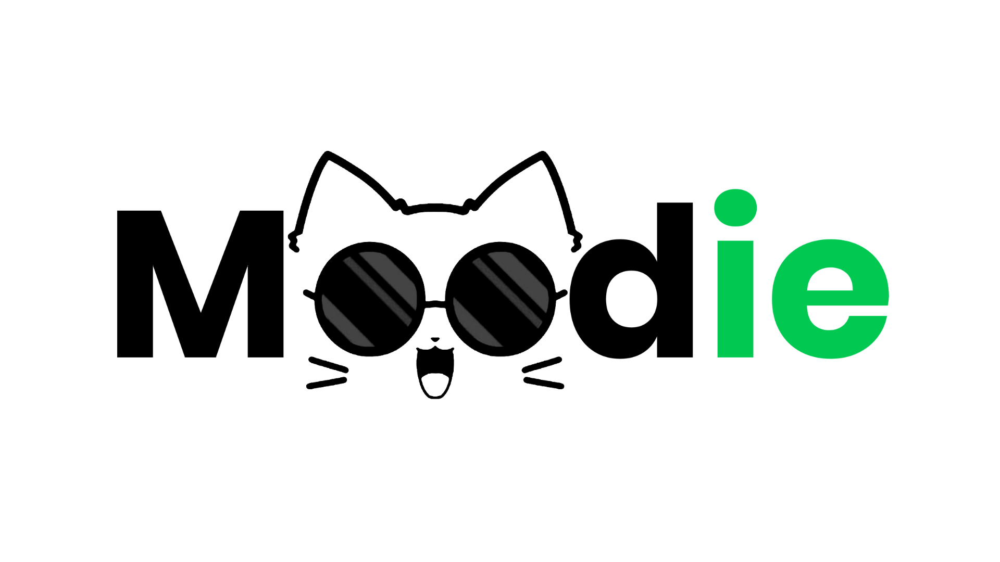

# Moodie

**Moodie** is a lightweight, interactive mood tracker designed for simplicity and emotional clarity. Whether you're trying to monitor your emotional wellbeing or just want to visualize your day-to-day moods, Moodie gives you a frictionless way to **record, reflect, and remember** how you feel — all in just a few taps.

---

## 🔗 Try Moodie

🌐 **Live App:** [https://moodie.chat](https://moodie.chat)

> Track your emotions effortlessly — one mood at a time.

---

## 🚀 Overview

Moodie focuses on **simple mood journaling** with **beautiful, emoji-driven design**. It allows users to quickly:

- 🌈 Log how they feel in the moment
- 📝 Add optional notes or tags
- 📅 View daily logs with color-coded entries
- 🧠 Reflect on trends and patterns over time

> “Your mood matters. Start tracking it — the easy way.”

---

## ✨ Features

### ✅ Core Highlights

- **Chat with AI Therapist**  
  Need someone to talk to? Open a private chat with our AI-powered emotional support system. It listens, offers empathetic responses, and helps you reflect without judgment — anytime, anywhere.

- **Mood-Based Food Scanner**  
  Scan your meals and get instant insights into how your diet might be affecting your mood. Our AI links nutritional content to emotional patterns, helping you make mindful food choices.

- **Daily Mood Journal**  
  Capture your thoughts and feelings through structured journaling. Whether it’s a quick note or a detailed reflection, Moodie helps you track emotional trends and improve mental clarity over time.

---

## 🧠 Moodie Use Cases

- Mental health journaling  
- Emotional pattern tracking  
- Habit-building and mindfulness  
- Daily check-ins for teams or classrooms  
- Minimal mood diaries for personal reflection

---

## 🛠️ Tech Stack

- React + Tailwind CSS  
- Internet Computer Protocol (ICP)  
- Motoko Smart Contract
- ShadCN UI for clean and modern components 
- React Router / Vite

---

## 📱 Mobile-First Design

Moodie is fully responsive and built for a great experience across:

- 📱 Smartphones  
- 💻 Laptops  
- 🖥️ Desktops  

> It’s perfect for quick entries whether you're on-the-go or reflecting at night.

---

## 📽️ Demo

> Watch demo video: [Moodie Demo](https://youtu.be/5NshaD7kOQs)

---

## 📌 License

This project is open-source under the MIT license.

---

## 🙌 Acknowledgements

- UI Components by [ShadCN](https://ui.shadcn.com/)
- Built with love using [React](https://react.dev/) and [Tailwind CSS](https://tailwindcss.com/)

---

**Track your mood. Know yourself better. Welcome to Moodie.**
